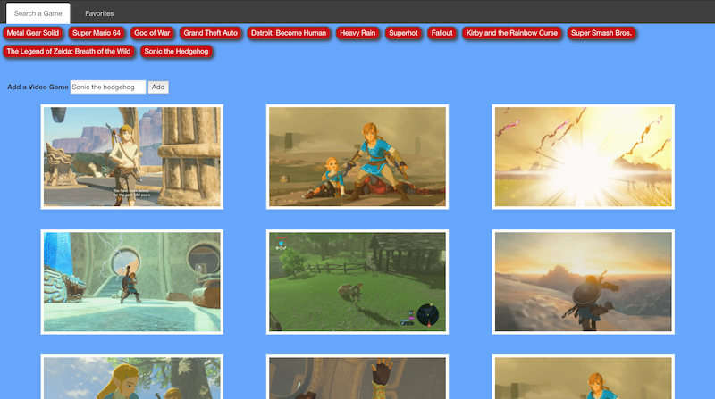
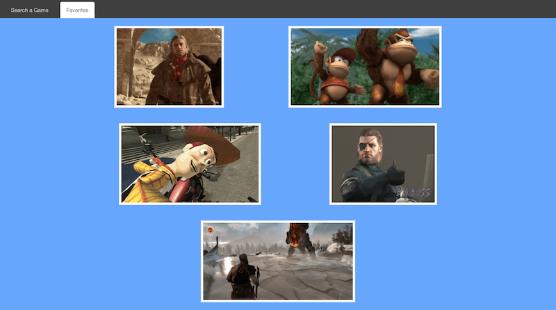

# GifTastic

This application communicates with two APIs, IGDB and Giphy. Upon searching a a title of any video game, the the IGDB API is sent a request for a matching video game title and returns a button of the same or similar name as the term searched for.

The application promptly searches the Giphy API for ten GIFs related to that videogame title and displays it on the page. This search process is optimized to return image results as soon as the term is searched for, or if one of the default buttons are clicked on.

Click the star to favorite or unfavorite a GIF, which is then stored in the favorites tab (even if the page reloads or exits), or click the download button to download a copy of the file to your computer.

This application is also mobile-friendly

Created by Arvin Zojaji

Have fun!